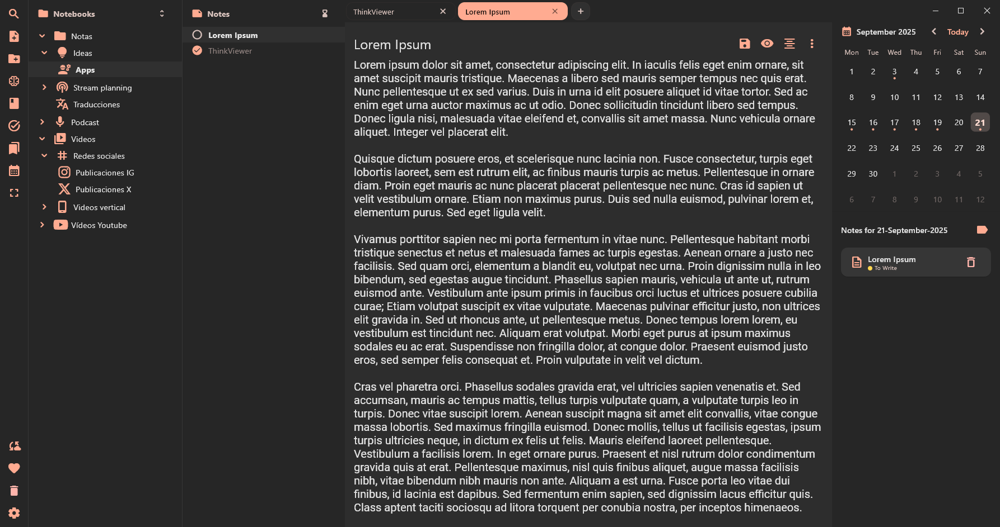
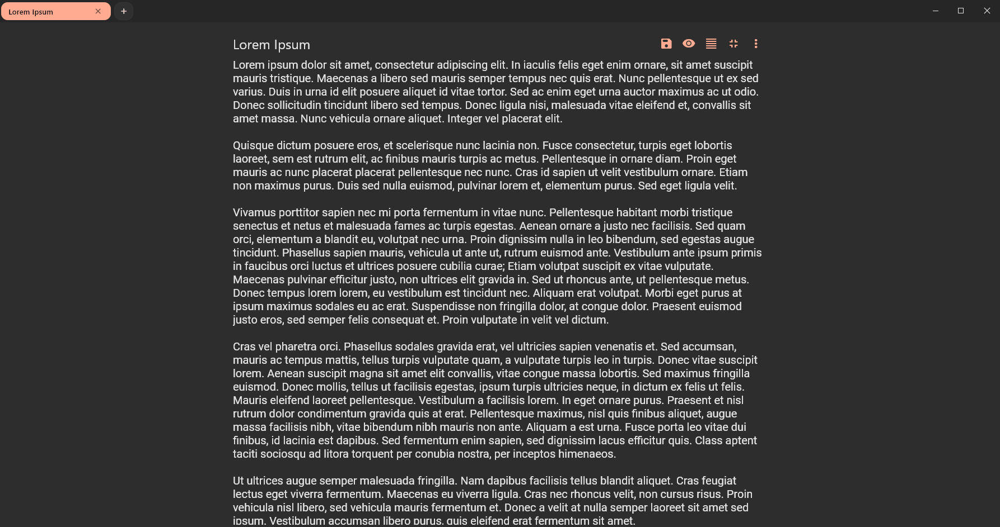
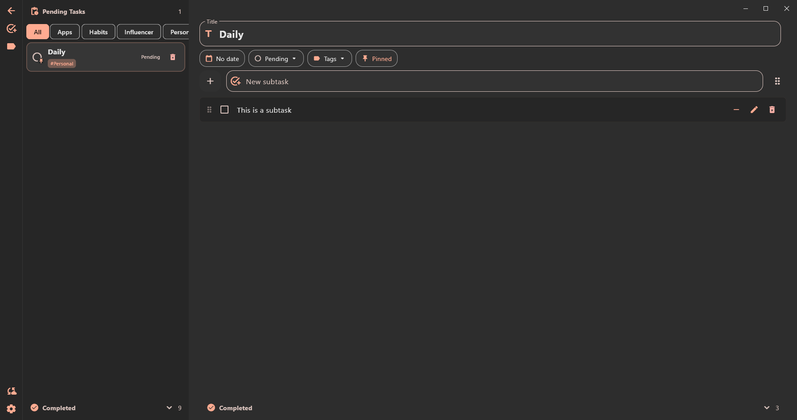
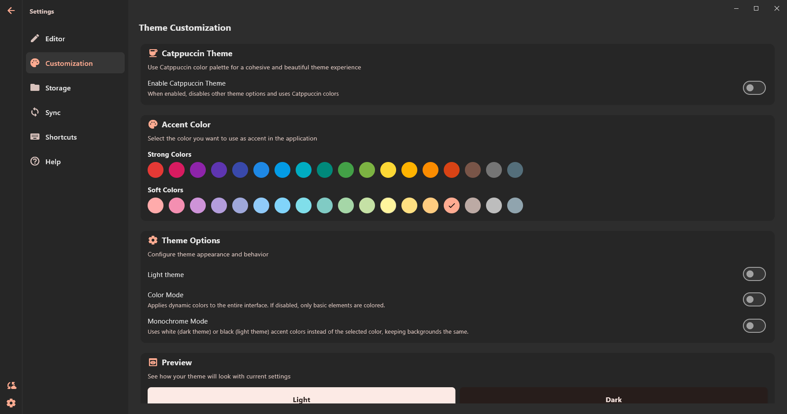
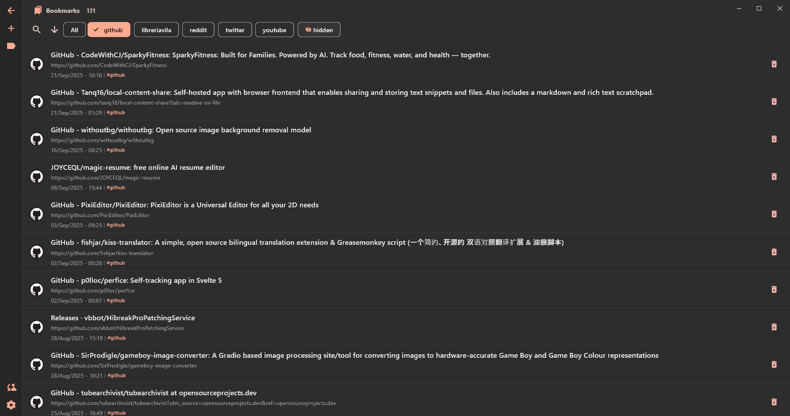
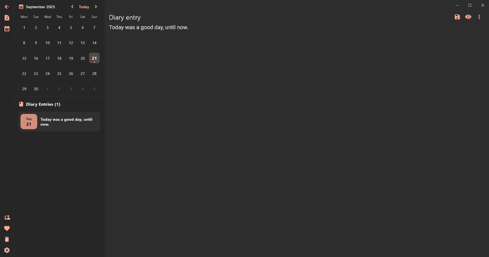
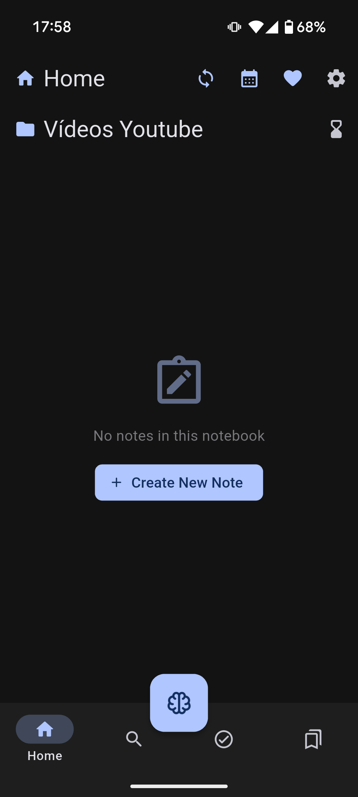
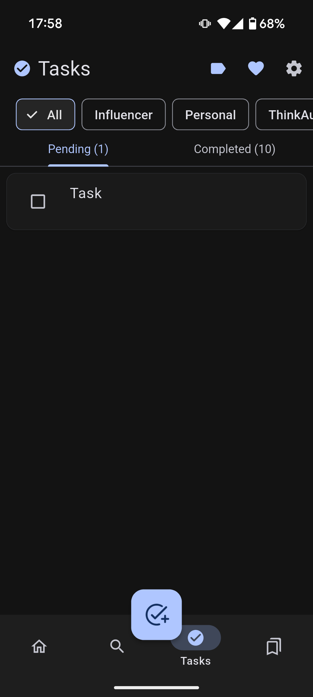
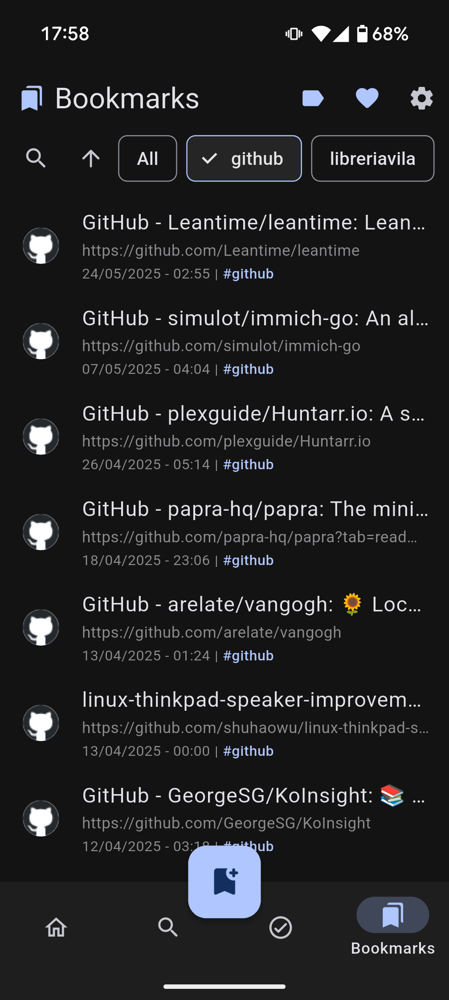
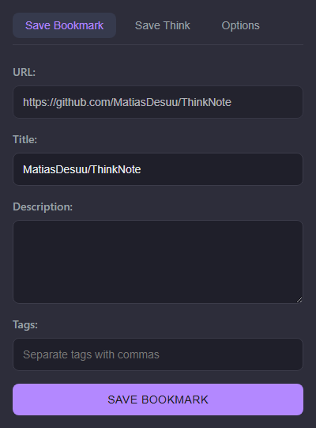

# 📘 NoteThink

**NoteThink** is a comprehensive productivity and knowledge management application designed to help you organize your ideas, tasks, and thoughts efficiently. Built with Flutter, it offers a cross-platform experience that works seamlessly on **desktop** (Windows and Linux) and **mobile** (Android).

<strong>Important:</strong> I'm not a developer, I'm just a simple guy that uses AI to make apps that thinks are useful for himself (and maybe others too).

## 📱 Screenshots

### 🖥️ Desktop Interface

Click any thumbnail to view the full-size image

<!-- Thumbnail gallery for main desktop screens -->

    
    
    
    
    

### 📱 Mobile Screenshots

  
  
  

### 📱 Extension Screenshots

  

## ✨ Key Features

### 📝 Content Management
- **Notes**: Simple text editor with some style support
- **Thinks**: Specialized system for capturing and organizing thoughts fast
- **Tasks**: Complete task management with subtasks, tags, and due dates
- **Diary**: Daily entries with integrated calendar view
- **Bookmarks**: Bookmark system with tags and categorization

### 🎨 Advanced Customization
- **Dynamic themes**: Material You support (Android) and custom themes
- **Catppuccin mode**: Predefined color palettes (Mocha, Latte, etc.)
- **Customizable editor**: Font size, spacing, colors, and fonts
- **Immersive mode**: Distraction-free writing experience
- **Adaptable interface**: Resizable panels and flexible layouts

### 🔄 Synchronization & Storage
- **Local sync**: SQLite database for local storage
- **WebDAV sync**: Support for personal WebDAV servers
- **Full database export**: Export to Folder structure + TXT files and HTML for bookmarks

### 🚀 Productivity
- **Keyboard shortcuts**: Fast navigation with keyboard
- **Global search**: Real-time search across all content
- **Favorites**: System for marking important content
- **Trash**: Secure content deletion management
- **Script mode**: Special functionality for scripts and presentations

### 📱 Cross-Platform Experience
- **Desktop**: Complete interface with resizable panels
- **Mobile**: Interface optimized for mobile devices
- **Offline-first**: Works without internet connection

## 🛠️ Technologies

- **Framework**: Flutter 3.7+
- **Database**: SQLite3
- **Sync**: WebDAV Client
- **Themes**: Material You / Dynamic Color
- **Platforms**: Windows, Linux, Android

## 📋 Project Status

### 🔄 Next updates
- 🔄 Clean the code (somehow)
- 🔄 Bug fixing
- 🔄 Refine existing systems

### 📝 Upcoming Features (no ETA)
- 📝 Redesigned note editor with full markdown support

## 🤝 Contributing

Contributions are welcome.

## 📄 License

This project is licensed under the MIT License. See the `LICENSE` file for details.