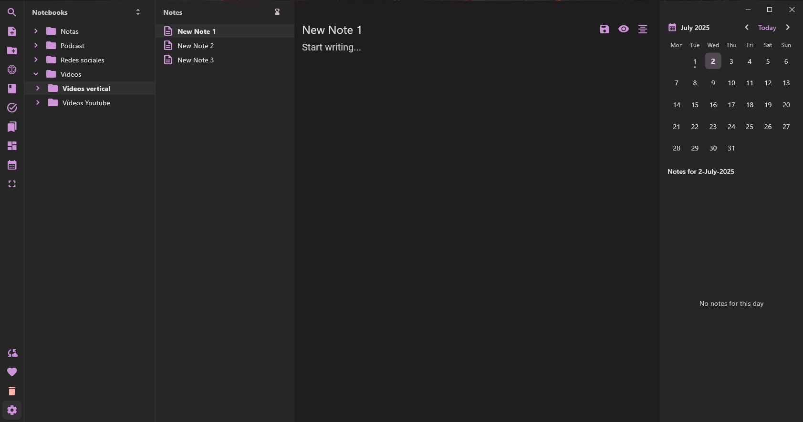
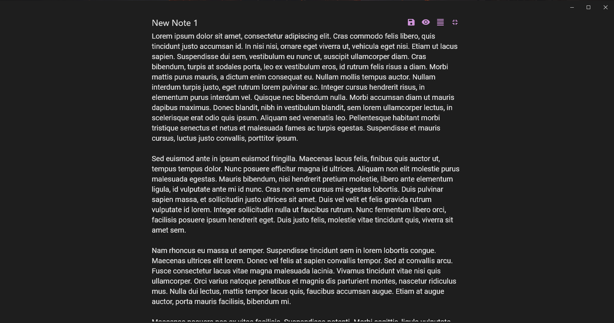
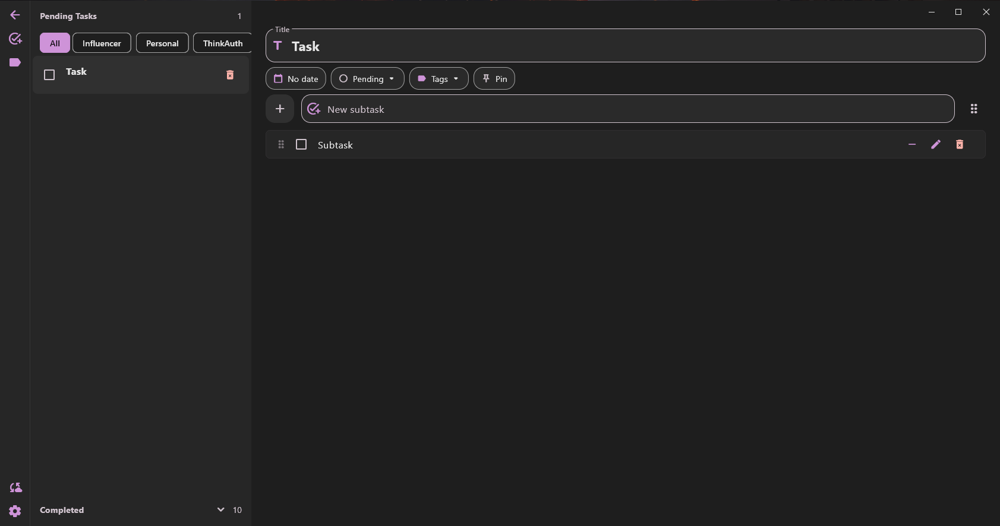
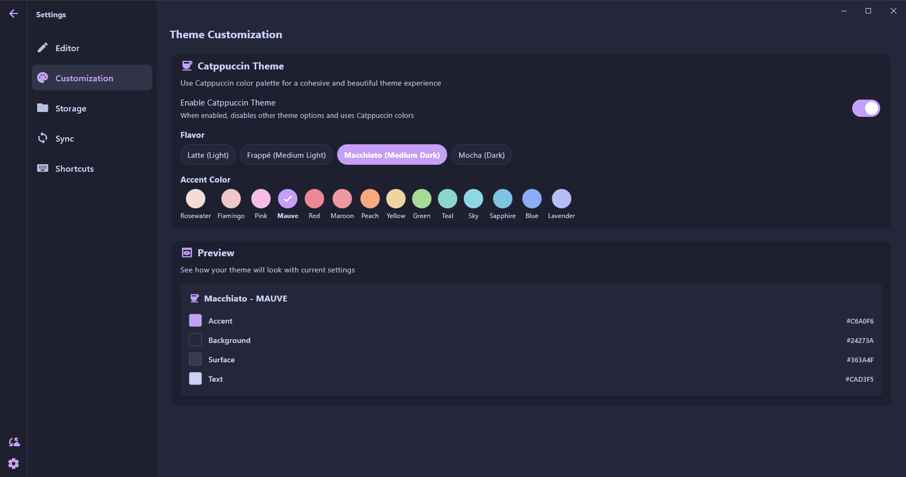
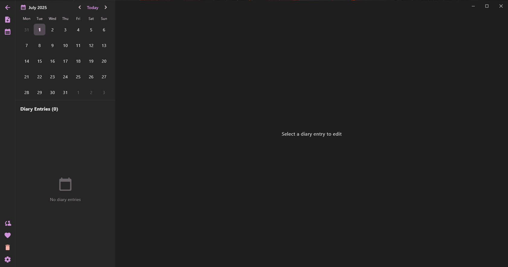
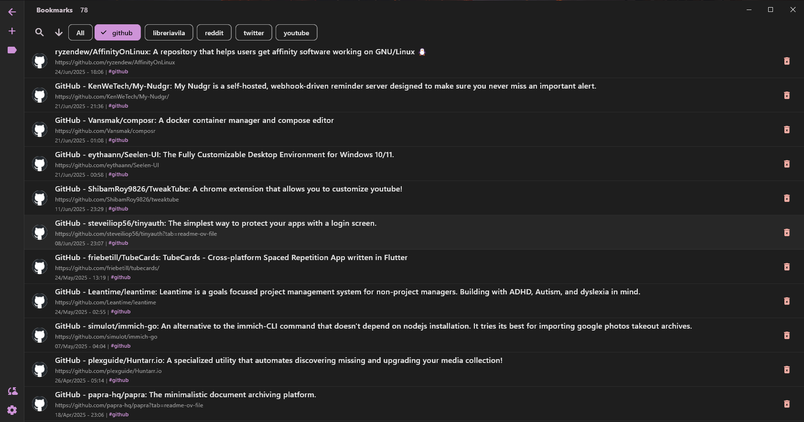
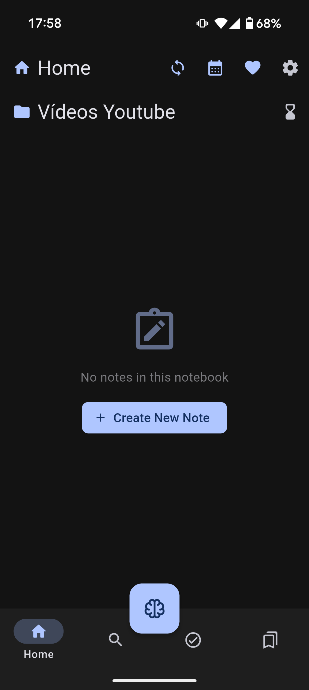
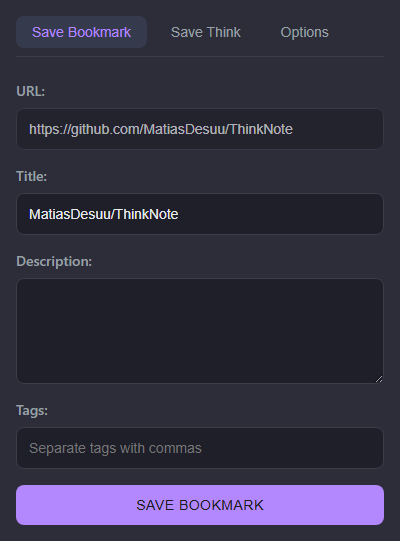

# 📘 NoteThink

**NoteThink** is a comprehensive productivity and knowledge management application designed to help you organize your ideas, tasks, and thoughts efficiently. Built with Flutter, it offers a cross-platform experience that works seamlessly on **desktop** (Windows and Linux) and **mobile** (Android).

## 📱 Screenshots

### 🖥️ Desktop Interface

### 📝 Notes Editor (distraction free mode)

### ✅ Task Management

### 🎨 Theme Customization

### 🔍 Diary screen

### 🔗 Bookmarks Screen

### 📱 Mobile Screenshots

  

### 📱 Extension Screenshots

## ✨ Key Features

### 📝 Content Management
- **Notes**: Simple text editor with personalization support and auto-save
- **Think Notes**: Specialized system for capturing and organizing thoughts
- **Tasks**: Complete task management with subtasks, tags, and due dates
- **Diary**: Daily entries with integrated calendar view
- **Bookmarks**: Bookmark system with tags and categorization

### 🎨 Advanced Customization
- **Dynamic themes**: Material You support and custom themes
- **Catppuccin mode**: Predefined color palettes (Mocha, Latte, etc.)
- **Customizable editor**: Font size, spacing, colors, and fonts
- **Immersive mode**: Distraction-free writing experience
- **Adaptable interface**: Resizable panels and flexible layouts

### 🔄 Synchronization & Storage
- **Local sync**: SQLite database for local storage
- **WebDAV sync**: Support for personal WebDAV servers
- **Full database export**: Export to Folder structure + TXT files and HTML for bookmarks

### 🚀 Productivity
- **Keyboard shortcuts**: Fast navigation with keyboard
- **Global search**: Real-time search across all content
- **Favorites**: System for marking important content
- **Trash**: Secure content deletion management
- **Script mode**: Special functionality for scripts and presentations

### 📱 Cross-Platform Experience
- **Desktop**: Complete interface with resizable panels
- **Mobile**: Interface optimized for mobile devices
- **Responsive**: Automatic adaptation to different screen sizes
- **Offline-first**: Works without internet connection

## 🛠️ Technologies

- **Framework**: Flutter 3.7+
- **Database**: SQLite3
- **Sync**: WebDAV Client
- **Themes**: Material You / Dynamic Color
- **Platforms**: Windows, Linux, Android

## 📋 Project Status

### ✅ Implemented
- ✅ Complete notes editor with auto-save
- ✅ Task system with subtasks and tags
- ✅ Bookmark management with categorization
- ✅ Personal diary with calendar view
- ✅ Dynamic themes and advanced customization
- ✅ WebDAV synchronization
- ✅ Cross-platform interface
- ✅ Global search system
- ✅ Immersive mode for writing
- ✅ Full database export and import
- ✅ Favorites and trash management

### 🔄 In Development
- 🔄 Performance optimization
- 🔄 Bug fixing

### 📝 Upcoming Features
- 📝 Note templates system
- 📝 Database tatistics
- 📝 File attachment support

## 🤝 Contributing

Contributions are welcome.

## 📄 License

This project is licensed under the MIT License. See the `LICENSE` file for details.

---

> **NoteThink** - Keep your thoughts structured, clear, and accessible, wherever you are. 🧠✨
